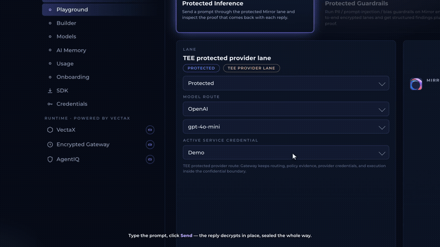

# Explainer Video

A **Claude Code skill + plugin** that turns product screenshots or a screen recording into an animated, camera-zooming **explainer video** — with **voiceover, background music, and time-synced sound effects**. It's interactive: Claude interviews you about design and voice, then builds everything.

The signature look: a dark, modern UI mockup the "camera" **zooms and pans** across, with **3D lifts** on elements as they're named, **ciphertext→plaintext morph** reveals, a **typed-prompt → click → result** flow, and synced **VO / music / SFX**.

## Demo



*From a real build: a typed prompt → **Send** → the reply **decrypts in place** (ciphertext → plaintext) with live attestation.*

> Example output: a 2K, ~2:40 explainer for *SAAS Company* — voiceover + background music + time-synced sound effects.

## What you get
- A self-contained animated **HTML** explainer (plays in any browser)
- A rendered **MP4** at your chosen resolution (up to 2K) with voiceover burned in
- **Separate** background-music and sound-effects stems (drop onto your own timeline)

## Skills in this plugin
The end-to-end `explainer-video` skill is the orchestrator. Its reusable techniques are also split into **focused, individually-invocable skills** — install the plugin once and invoke whichever fits the task:
- **`explainer-video`** — interactive, end-to-end product explainer (design interview → HTML → render → audio).
- **`smooth-render`** — render any HTML/CSS animation to a sharp, **non-choppy** MP4 (slow-clock + heartbeat logical-time capture); for glassy/blur/gradient/continuous-motion scenes that stutter when captured.
- **`kinetic-typography`** — animated headlines: word-cascade reveals, a centered hero headline **pushed aside** as content slides in, top/bottom lines that slide out of the headline, and a **cracked-word** effect.
- **`glass-cards`** — frosted **liquid-glass** panels on a dark animated background; a card **zooms forward** to demo then **falls back** as the next rises, with a gentle camera zoom-in/settle.
- **`vo-sync`** — generate voiceover with **word timestamps** and compute scene durations + cue times so visuals **land on the spoken word** with a tight, gap-free timeline.
- **`audio-stems`** — generate + place **separate** voiceover / music / SFX tracks on a known timeline (event-synced whooshes, typing, risers, dings…), with an optional ducked master.

## Requirements
- [Claude Code](https://claude.com/claude-code)
- `ffmpeg`
- To render the MP4: **Node.js** + `npm i puppeteer-core` + **Google Chrome** installed
- **Python 3** (audio helper scripts)
- Optional: an **ElevenLabs API key** for voiceover/music/SFX — or use macOS `say`, bring-your-own TTS, or no audio

## Install

### Option A — as a plugin (recommended)
In Claude Code:
```
/plugin marketplace add JagZ999/explainer-video
/plugin install explainer-video@explainer-video
```
Then run the slash command:
```
/explainer
```

### Option B — manual skill install
```
git clone https://github.com/JagZ999/explainer-video
cp -r explainer-video/skills/explainer-video ~/.claude/skills/
```
Then just tell Claude: *"make an explainer video for my product."*

## Usage
Run `/explainer` (or ask). Claude will:
1. Collect your screenshots / screen recording / logo into one working folder
2. Interview you on design — style, colors, fonts, logo, scene order, tagline, and which animations to use
3. Build and preview the animated HTML
4. Ask your **TTS provider** (ElevenLabs / macOS `say` / bring-your-own / none) and, if needed, the **API key**, plus music mood & SFX
5. Generate voiceover (with word timestamps so 3D lifts land on the spoken word), music, and a synced SFX track
6. Ask the resolution and render to MP4

## How it works
See [`skills/explainer-video/reference/ARCHITECTURE.md`](skills/explainer-video/reference/ARCHITECTURE.md) — the scene/camera/cue engine, the ciphertext morph, the audio-as-master-clock, and the native-resolution **logical-time render** that keeps the video perfectly in sync (no upscale blur, no audio drift).

## Repo layout
```
.claude-plugin/          plugin + marketplace manifests
commands/explainer.md    the /explainer slash command
skills/
  explainer-video/       end-to-end orchestrator (SKILL.md, assets/, scripts/, reference/)
  smooth-render/         scripts/render.js (slow-clock + heartbeat), assemble.js
  kinetic-typography/    assets/kinetic.css + kinetic.js (word-cascade, hero→push, crack)
  glass-cards/           assets/glass.css + glass.js (liquid-glass cards, zoom-forward/fall-back, camera)
  vo-sync/               scripts/compute_timing.js, elevenlabs.py, reference/VO_SYNC.md
  audio-stems/           scripts/build_sfx.py, mix.sh, elevenlabs.py
```

## License
MIT — see [`LICENSE`](LICENSE).

---
*Built with Claude Code.*
