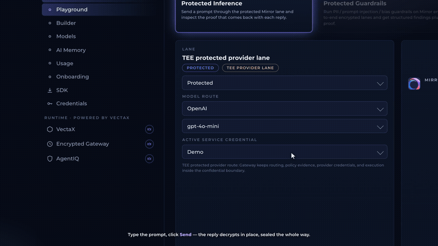
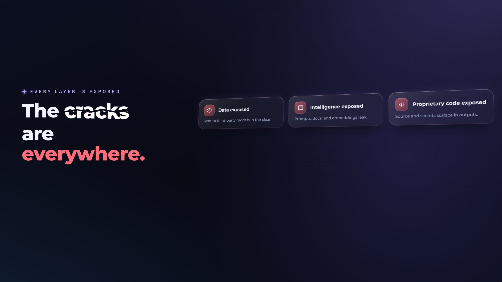
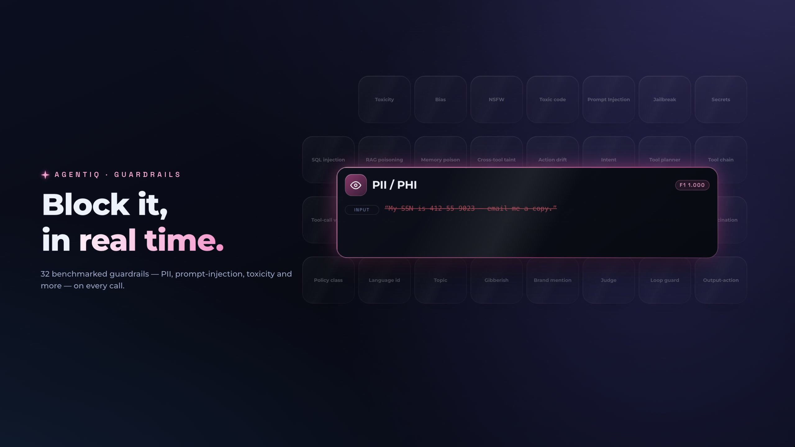
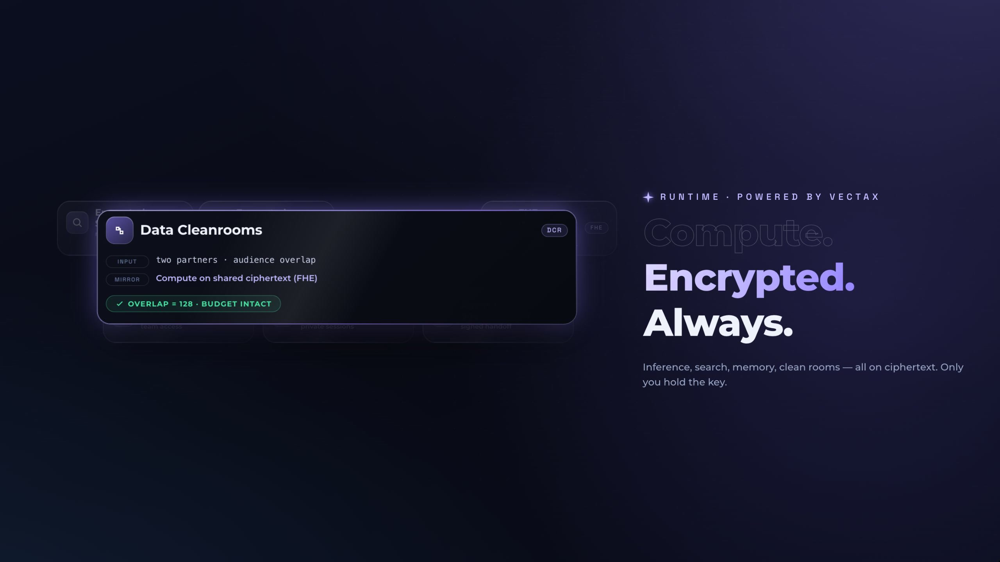
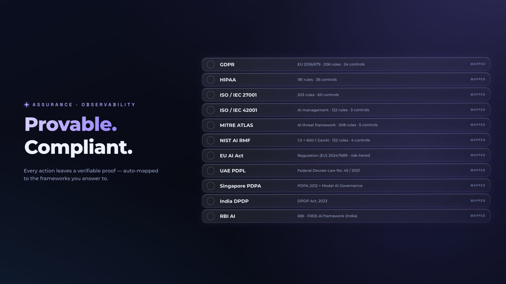

# Explainer Video

A **Claude Code skill + plugin** that turns product screenshots or a screen recording into an animated, camera-zooming **explainer video** — with **voiceover, background music, and time-synced sound effects**. It's interactive: Claude interviews you about design and voice, then builds everything.

The signature look: a dark, modern UI mockup the "camera" **zooms and pans** across, with **3D lifts** on elements as they're named, **ciphertext→plaintext morph** reveals, a **typed-prompt → click → result** flow, and synced **VO / music / SFX**.

## Demo



*From a real build: a centered **hero headline** is pushed aside as **liquid-glass cards** slide in and one **zooms forward** to demo itself — kinetic typography + glassmorphism.*

> Example output: a 2K AI-security product explainer — voiceover + background music + time-synced sound effects.

### Gallery
| | |
|---|---|
|  |  |
| *Word-cascade headline with a **cracked-word** effect, on liquid-glass cards* | *A card **zooms forward** out of the grid to run its check* |
|  |  |
| *Dark, opaque **glass panel** zoomed forward; the rest dim behind it* | *Camera-framed feature panel + auto-mapped compliance* |

## What you get
- A self-contained animated **HTML** explainer (plays in any browser)
- A rendered **MP4** at your chosen resolution (up to 2K) with voiceover burned in
- **Separate** background-music and sound-effects stems (drop onto your own timeline)

## Skills in this plugin
The end-to-end `explainer-video` skill is the orchestrator. Its reusable techniques are also split into **focused, individually-invocable skills** — install the plugin once and invoke whichever fits the task:
- **`explainer-video`** — interactive, end-to-end product explainer (design interview → HTML → render → audio).
- **`motion-graphics`** ⭐ — **the super-skill**: a named **platter of ~56 reusable motion moves** across 8 families (text, backgrounds & gradients, elements/particles, glass & UI, product/composition, scene transitions, UI & data motion, aesthetic presets), plus a drop-in `assets/motion.css` + `motion.js` library. Ask for **"the platter"** to get the whole menu. Distilled from launch-reel / SaaS-explainer references. The families below are its sub-skills:
  - **`text-motion`** (A) — keyword glow-sweeps, gradient-fill hero words, scramble-decode, ticker-roll, motion-blur slide, mixed-type lines.
  - **`backgrounds-gradients`** (B) — color-arc gradients + drifting blobs, mesh-wash, blueprint/dot grids, neon paths, starfield, grain/texture.
  - **`element-motion`** (C) — ring ripples, floating bokeh rings, orb bloom, converge, metaball merge, gooey blobs, sparkle, line-draw.
  - **`glass-cards`** (D) — frosted liquid-glass panels (below).
  - **`product-motion`** (E) — integrations orbit, icon constellation, UI-screen reveal, avatar chips, card-stack fan.
  - **`scene-transitions`** (F) — shape wipe, iris reveal, mask push, match-cut, liquid wipe, dissolve-over-gradient.
  - **`ui-data-motion`** (G) — bar-grow, line-draw, counter-tick, card deal, toggle, cursor demo, notification pop, timeline scrubber.
  - **`aesthetic-presets`** (H) — isometric, collage/cutout, Apple-minimalist, crypto/neon-glow, dashboard-reveal whole-scene looks.
- **`smooth-render`** — render any HTML/CSS animation to a sharp, **non-choppy** MP4 (slow-clock + heartbeat logical-time capture); for glassy/blur/gradient/continuous-motion scenes that stutter when captured.
- **`kinetic-typography`** — animated headlines: word-cascade reveals, a centered hero headline **pushed aside** as content slides in, top/bottom lines that slide out of the headline, and a **cracked-word** effect.
- **`glass-cards`** — frosted **liquid-glass** panels on a dark animated background; a card **zooms forward** to demo then **falls back** as the next rises, with a gentle camera zoom-in/settle.
- **`vo-sync`** — generate voiceover with **word timestamps** and compute scene durations + cue times so visuals **land on the spoken word** with a tight, gap-free timeline.
- **`audio-stems`** — generate + place **separate** voiceover / music / SFX tracks on a known timeline (event-synced whooshes, typing, risers, dings…), with an optional ducked master.

## Requirements
- [Claude Code](https://claude.com/claude-code)
- `ffmpeg`
- To render the MP4: **Node.js** + `npm i puppeteer-core` + **Google Chrome** installed
- **Python 3** (audio helper scripts)
- Optional: an **ElevenLabs API key** for voiceover/music/SFX — or use macOS `say`, bring-your-own TTS, or no audio

## Install

### Option A — as a plugin (recommended)
In Claude Code:
```
/plugin marketplace add JagZ999/explainer-video
/plugin install explainer-video@explainer-video
```
Then run the slash command:
```
/explainer
```

### Option B — manual skill install
```
git clone https://github.com/JagZ999/explainer-video
cp -r explainer-video/skills/explainer-video ~/.claude/skills/
```
Then just tell Claude: *"make an explainer video for my product."*

## Usage
Run `/explainer` (or ask). Claude will:
1. Collect your screenshots / screen recording / logo into one working folder
2. Interview you on design — style, colors, fonts, logo, scene order, tagline, and which animations to use
3. Build and preview the animated HTML
4. Ask your **TTS provider** (ElevenLabs / macOS `say` / bring-your-own / none) and, if needed, the **API key**, plus music mood & SFX
5. Generate voiceover (with word timestamps so 3D lifts land on the spoken word), music, and a synced SFX track
6. Ask the resolution and render to MP4

## How it works
See [`skills/explainer-video/reference/ARCHITECTURE.md`](skills/explainer-video/reference/ARCHITECTURE.md) — the scene/camera/cue engine, the ciphertext morph, the audio-as-master-clock, and the native-resolution **logical-time render** that keeps the video perfectly in sync (no upscale blur, no audio drift).

## Repo layout
```
.claude-plugin/          plugin + marketplace manifests
commands/explainer.md    the /explainer slash command
skills/
  explainer-video/       end-to-end orchestrator (SKILL.md, assets/, scripts/, reference/)
  smooth-render/         scripts/render.js (slow-clock + heartbeat), assemble.js
  kinetic-typography/    assets/kinetic.css + kinetic.js (word-cascade, hero→push, crack)
  glass-cards/           assets/glass.css + glass.js (liquid-glass cards, zoom-forward/fall-back, camera)
  vo-sync/               scripts/compute_timing.js, elevenlabs.py, reference/VO_SYNC.md
  audio-stems/           scripts/build_sfx.py, mix.sh, elevenlabs.py
  motion-graphics/       ⭐ master — SKILL.md + PLATTER.md + assets/motion.css + motion.js (shared library)
  text-motion/           (A) assets/textmotion.css + textmotion.js — text entrances & emphasis
  backgrounds-gradients/ (B) living gradients, mesh-wash, grids, neon paths, starfield, texture
  element-motion/        (C) rings, orbs, particles, metaball, gooey blobs, sparkle, line-draw
  product-motion/        (E) integrations orbit, screen reveal, avatar chips, card fan
  scene-transitions/     (F) shape/iris/mask/match-cut/liquid/dissolve
  ui-data-motion/        (G) bar-grow, line-draw, counter, card-deal, toggle, timeline
  aesthetic-presets/     (H) isometric, collage, minimalist, crypto-neon, dashboard
```
(Families B–H share the master's `motion-graphics/assets/motion.{css,js}`; D = `glass-cards`.)

## License
MIT — see [`LICENSE`](LICENSE).

---
*Built with Claude Code.*
